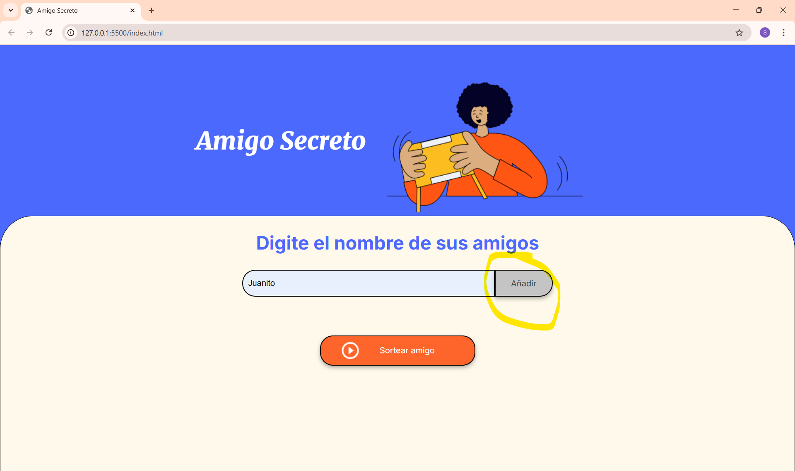
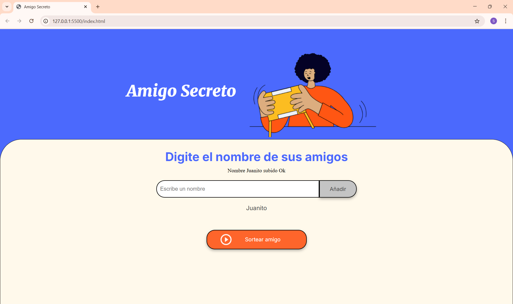
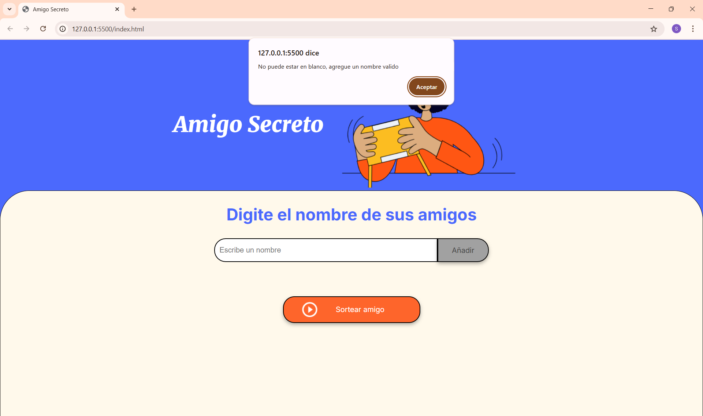
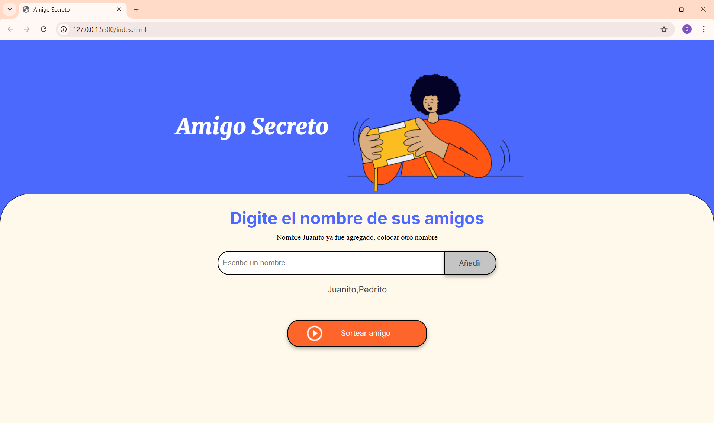

<h1>Amigo Secreto</h1>

esta página es parte del primer challenge

Fucionalidades:
Esta pagina permite ingresar los nombres de un grupo de amigos para que finalmente el computador escoja quien es el mejor amigo de ellos

Para el funcionamiento normal se debe agregar los nombres en el recuadro y posteriormente presionar el botón

Debajo de Digite su nombre en letras azules se indica si se subió ok el nombre o no, además se puede ver en un listado abajo del cuadro de texto

cuando está ingresada la lista de amigos, se presiona el boton sortear amigo y el computador hace la elección al azar, el resultado se ve en letras verdes, los dos botones quedan deshabilitados y cambian de color

hay control de errores , el nombre no puede ser vacio al tratar de subirlo, arroja una alert

el otro error que controla es que no puede repetirse el nombre, arroja un mensaje arriba del cuadro de texto e impide que suba a la lista

